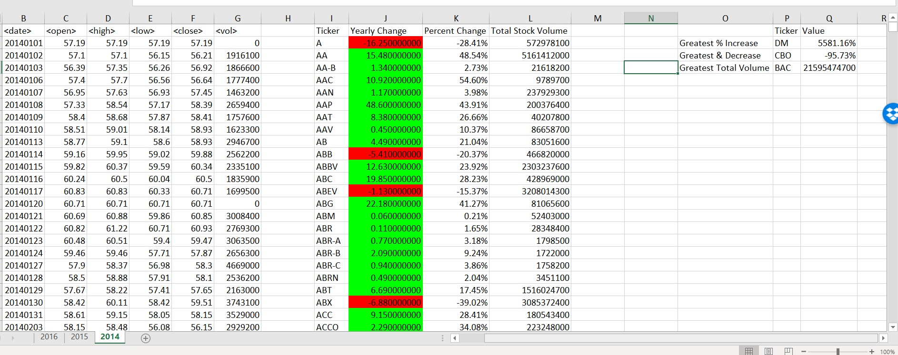

# VBA-Homework
VBA Homework

This repo consists of the following files:
   1. Alphabet Testing Excel file on which the test code was run
   2. Module 1, VBA script that was created to test over the Alphabet Testing Excel file
   3. Multi Stock Data Excel FIle
   4. MSD Module, VBA acripth that runs over Multi Stock Data Excel File
   5. Testdata VBS file that contains the VBA script that was created to run on both the files

The code perfroms the following functions:
    1. Runs over all the sheets in the excel file
    2. Searches for all the unique ticker symbols in the excel file and calculates the yearly change, percent change, and total volume for each ticker symbol into seperate columns
    3. From those new created column find the max and min of the percent change. Also, find the max of the volume
    4. Apply conditional formatting to cells
    5. Apply Number formatting to cells

## Screenshots from Multi Stock Data

**2014**

**2015**

**2016**

